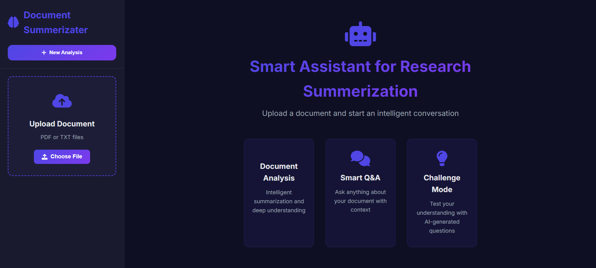
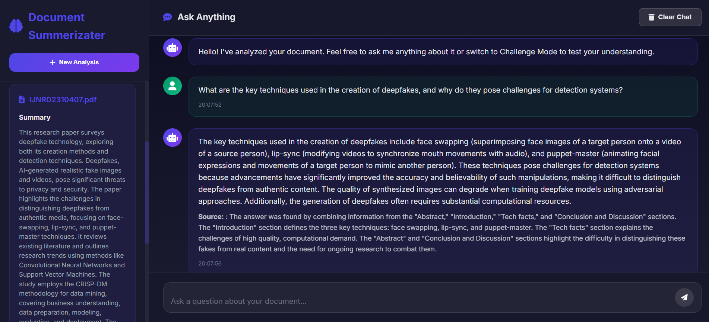
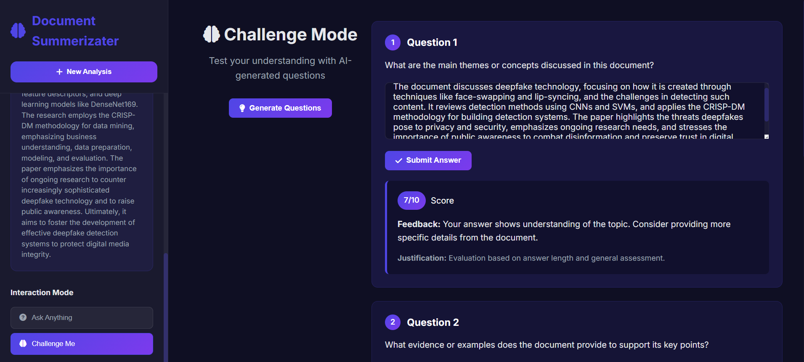

# 🌟 Smart Assistance for Research Summerization

A modern GenAI-powered web application that uses **Google's Gemini 2.0 Flash** to analyze uploaded documents and provide intelligent Q&A capabilities with logic-based challenge questions.

---

## 🖼️ Demo & Screenshots

### 🔹 Live Demo
> 📹 [Watch Demo on YouTube](https://www.youtube.com/watch?v=p1P1N8Yg4qg)

### 🔸 Screenshots
Upload Screen 


Ask Anything


Challenge Mode



## 🚀 Features

- 📄 **Multi-format Upload**: PDF and TXT support with encoding-safe processing
- 🤖 **Gemini 2.0 AI Analysis**: Document summarization, Q&A, and challenge generation
- 💬 **Ask Anything Mode**: Natural Q&A from uploaded content
- 🧩 **Challenge Me Mode**: Logic-based challenge questions with AI evaluation
- 🌐 **Modern UI**: Gradient backgrounds, loading indicators, mobile-ready layout
- 🔧 **Flask REST API**: Clean endpoints for file upload, Q&A, and evaluation

---

## 🧠 Use Case

Use this assistant to:
- Auto-summarize long research papers
- Ask document-aware questions
- Test understanding with logic-based quizzes
- Impress recruiters with a smart, real-world GenAI application

---

## 🧱 Architecture

### 📦 Backend (Flask, Python)
- RESTful API
- Text extraction from PDF/TXT
- Gemini API integration
- Session-based context management

### 🎨 Frontend (HTML, CSS, JavaScript)
- Responsive, animated UI
- Drag-and-drop file upload
- Dynamic Q&A display
- REST API integration using `fetch`

---

## 📂 Project Structure
```
├── backend/
│   ├── app.py              # Flask application
│   ├── ai_assistant.py     # OpenAI integration
│   └── document_processor.py # Document processing
├── frontend/
│   ├── index.html          # Main HTML file
│   ├── styles.css          # Styling
│   └── script.js           # JavaScript logic
├── README.md               # This file
└── replit.md              # Project documentation
```

---

# AI Document Assistant

## 🚀 Quick Setup

### 1. Clone the repository
```
bash
git clone https://github.com/yourusername/ai-document-assistant.git
cd ai-document-assistant
```
##Set up virtual environment
```
python3 -m venv venv
source venv/bin/activate
```
# For Windows
```
python -m venv venv
.\venv\Scripts\activate
```

## Install dependencies
```
pip install flask PyPDF2 python-docx google-generativeai werkzeug python-dotenv
```

## Configure environment
```
echo "GEMINI_API_KEY=your_api_key_here" > .env
echo "FLASK_ENV=development" >> .env
echo "UPLOAD_FOLDER=uploads" >> .env
```

## Create uploads directory
```mkdir uploads ```


## Run the application
```
python app.py

# Option 2: Run with Flask
flask run --host=0.0.0.0 --port=5000
```

## Testing the API
```
curl -X POST -F "file=@sample.txt" http://localhost:5000/api/upload
curl -X POST -F "file=@document.pdf" http://localhost:5000/api/upload
```

## With Python requests
```
import requests

url = "http://localhost:5000/api/upload"
files = {"file": open("test.docx", "rb")}
response = requests.post(url, files=files)
print(response.json())
```

## License
```
MIT License - See LICENSE file for details
```


