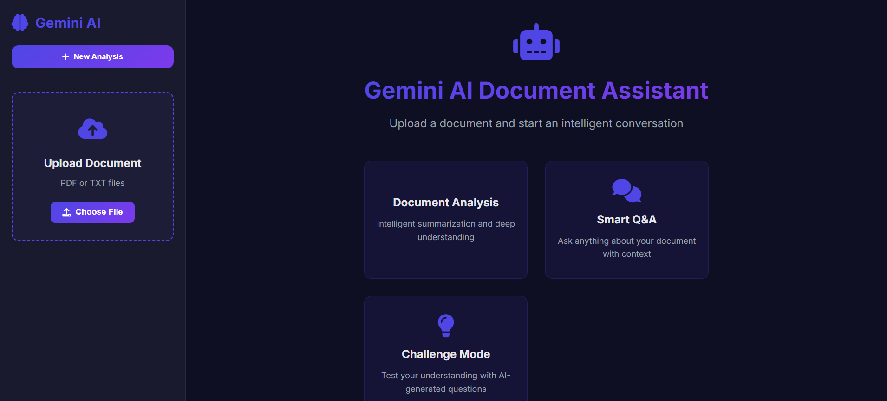
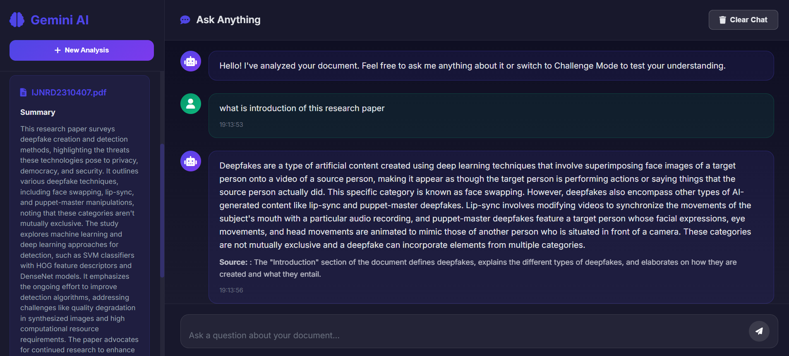

# 🌟 Gemini AI Document Analysis Assistant

A modern GenAI-powered web application that uses **Google's Gemini 2.0 Flash** to analyze uploaded documents and provide intelligent Q&A capabilities with logic-based challenge questions.

---

## 🖼️ Demo & Screenshots

### 🔹 Live Demo (Optional)
> 📹 [Watch Demo on YouTube](https://www.youtube.com/watch?v=YOUR_VIDEO_LINK)

### 🔸 Screenshots
Upload Screen 

Interactive Q&A

## 🚀 Features

- 📄 **Multi-format Upload**: PDF and TXT support with encoding-safe processing
- 🤖 **Gemini 2.0 AI Analysis**: Document summarization, Q&A, and challenge generation
- 💬 **Ask Anything Mode**: Natural Q&A from uploaded content
- 🧩 **Challenge Me Mode**: Logic-based challenge questions with AI evaluation
- 🌐 **Modern UI**: Gradient backgrounds, loading indicators, mobile-ready layout
- 🔧 **Flask REST API**: Clean endpoints for file upload, Q&A, and evaluation

---

## 🧠 Use Case

Use this assistant to:
- Auto-summarize long research papers
- Ask document-aware questions
- Test understanding with logic-based quizzes
- Impress recruiters with a smart, real-world GenAI application

---

## 🧱 Architecture

### 📦 Backend (Flask, Python)
- RESTful API
- Text extraction from PDF/TXT
- Gemini API integration
- Session-based context management

### 🎨 Frontend (HTML, CSS, JavaScript)
- Responsive, animated UI
- Drag-and-drop file upload
- Dynamic Q&A display
- REST API integration using `fetch`

---

## 📂 Project Structure

